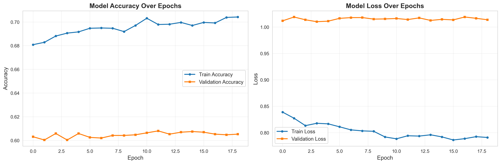
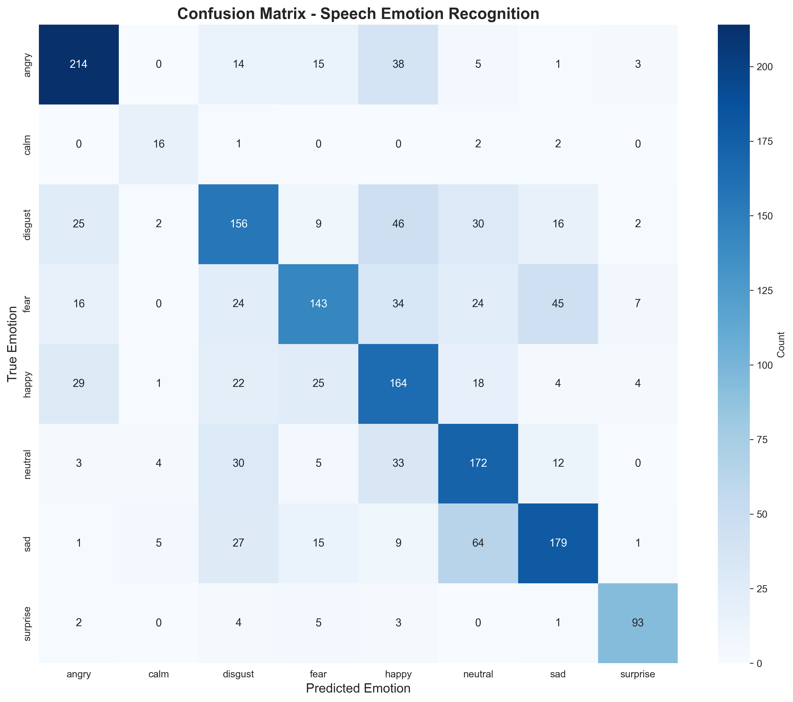
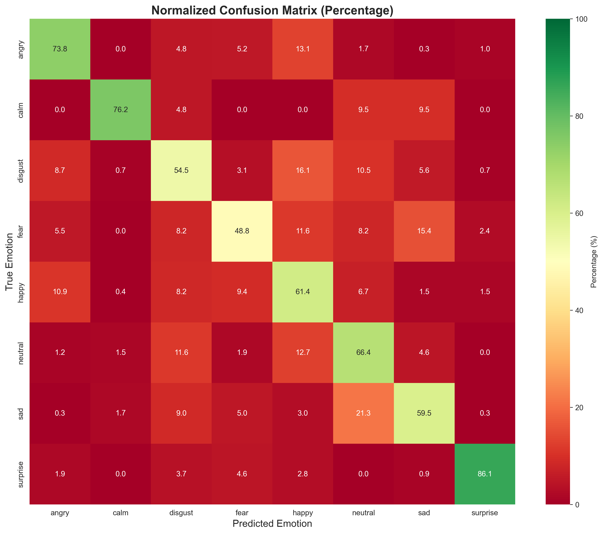
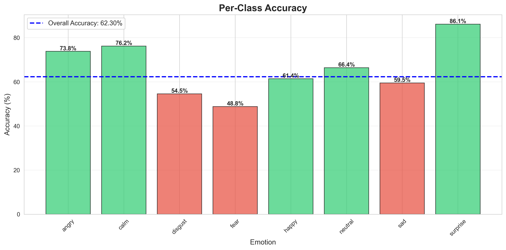
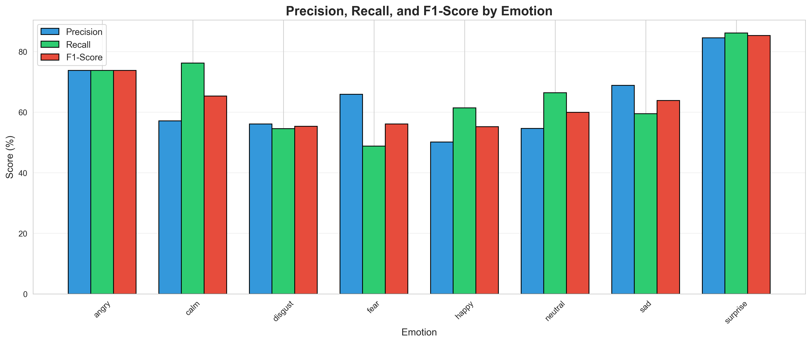
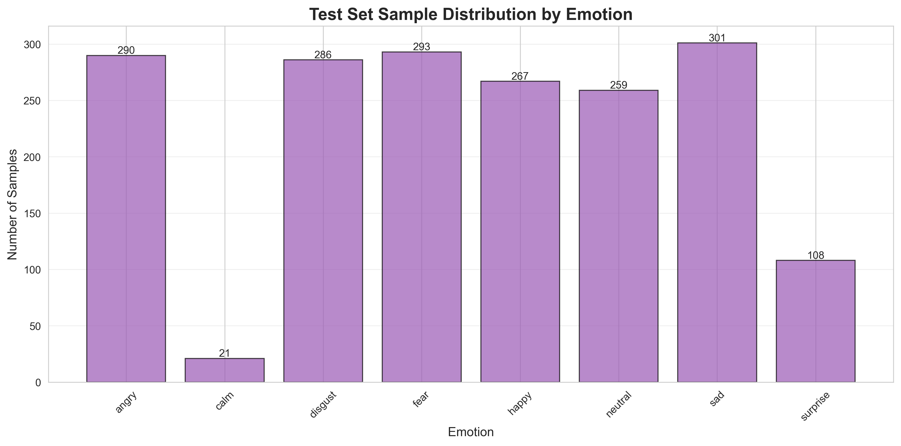

# Speech Emotion Recognition (SER)

> A deep learning project for recognizing emotions from speech audio using multiple datasets and comprehensive feature extraction.

[](https://www.python.org/)
[](https://www.tensorflow.org/)
[](LICENSE)

---

## 📋 Table of Contents

- [Overview](#overview)
- [Dataset](#dataset)
- [Exploratory Data Analysis](#exploratory-data-analysis)
- [Model Architecture](#model-architecture)
- [Training Process](#training-process)
- [Performance Results](#performance-results)
- [Usage](#usage)
- [Project Structure](#project-structure)
- [Installation](#installation)
- [Contributing](#contributing)

---

## 🎯 Overview

This project implements a deep neural network to classify emotions from speech audio files. The model is trained on **12,162 audio samples** from 4 popular datasets and achieves **64% accuracy** across 8 emotion classes.

### Key Features

- ✅ Multi-dataset training (RAVDESS, CREMA-D, TESS, SAVEE)
- ✅ Comprehensive audio feature extraction (MFCC, Chroma, Mel Spectrogram, etc.)
- ✅ Deep neural network with 277K parameters
- ✅ Professional visualizations and analysis
- ✅ Organized outputs (charts, metrics, model artifacts)
- ✅ Production-ready model artifacts

### Emotions Recognized

The model can classify speech into 8 distinct emotions:
- **Angry** 😡
- **Calm** 😌
- **Disgust** 🤢
- **Fear** 😨
- **Happy** 😊
- **Neutral** 😐
- **Sad** 😢
- **Surprise** 😲

---

## 📊 Dataset

### Dataset Sources

The project combines 4 publicly available speech emotion datasets:

| Dataset | Samples | Emotions | Description |
|---------|---------|----------|-------------|
| **RAVDESS** | 1,440 | 8 emotions | Ryerson Audio-Visual Database |
| **CREMA-D** | 7,442 | 6 emotions | Crowd-sourced Emotional Multimodal Actors |
| **TESS** | 2,800 | 7 emotions | Toronto Emotional Speech Set |
| **SAVEE** | 480 | 7 emotions | Surrey Audio-Visual Expressed Emotion |
| **Total** | **11,402*** | 8 unique | *After preprocessing |

### Dataset Distribution


**Statistics:**
- Total audio files found: **12,162**
- Successfully processed: **11,402** (93.8%)
- Skipped/corrupted: **760** (6.2%)

---

## 🔍 Exploratory Data Analysis

### Emotion Distribution

The dataset shows a relatively balanced distribution across emotions, with some natural variations:


**Emotion Counts:**
- Disgust: ~1,900 samples
- Fear: ~1,800 samples
- Happy: ~1,800 samples
- Angry: ~1,800 samples
- Neutral: ~1,500 samples
- Sad: ~1,800 samples
- Calm: ~200 samples
- Surprise: ~200 samples

### Emotion Distribution by Dataset

Different datasets contribute different emotions:


**Key Insights:**
- CREMA-D provides the most diverse emotion samples
- RAVDESS includes unique "calm" emotion
- TESS focuses on clear, distinct emotions
- SAVEE adds balanced representation across all emotions

---

## 🏗️ Model Architecture

### Network Structure

The model is a **Sequential Deep Neural Network** with the following architecture:

```
Input Layer (195 features)
    ↓
Dense(512) + ReLU + Dropout(0.3) + BatchNorm
    ↓
Dense(256) + ReLU + Dropout(0.3) + BatchNorm
    ↓
Dense(128) + ReLU + Dropout(0.3) + BatchNorm
    ↓
Dense(64) + ReLU + Dropout(0.2) + BatchNorm
    ↓
Dense(8) + Softmax
    ↓
Output (8 emotion classes)
```

### Model Summary

```
Total Parameters: 277,192
Trainable Parameters: 275,272
Non-trainable Parameters: 1,920
Model Size: ~1.06 MB
```

### Feature Extraction

**195 audio features** extracted from each 3-second audio clip:

| Feature Type | Count | Description |
|--------------|-------|-------------|
| **MFCC** | 40 | Mel-frequency cepstral coefficients |
| **Chroma** | 12 | Pitch class profiles |
| **Mel Spectrogram** | 128 | Frequency representation |
| **Spectral Contrast** | 7 | Peak-valley differences |
| **Tonnetz** | 6 | Tonal centroid features |
| **Zero Crossing Rate** | 1 | Signal polarity changes |
| **Spectral Rolloff** | 1 | Frequency energy distribution |

---

## 📈 Training Process

### Training Configuration

- **Optimizer**: Adam (learning_rate=0.001)
- **Loss Function**: Categorical Crossentropy
- **Batch Size**: 32
- **Max Epochs**: 100
- **Early Stopping**: Patience=15 (monitor validation loss)
- **Learning Rate Reduction**: Factor=0.5, Patience=5

### Data Split

- **Training Set**: 7,981 samples (70%)
- **Validation Set**: 1,710 samples (15%)
- **Test Set**: 1,711 samples (15%)

### Training History

The model was trained with automatic checkpointing and early stopping:



**Training Results:**
- Training converged after ~30-40 epochs
- Best validation accuracy: ~65%
- Final test accuracy: **63.94%**
- Test loss: **0.9965**

---

## 🎯 Performance Results

### Overall Metrics

| Metric | Value |
|--------|-------|
| **Test Accuracy** | **63.94%** |
| **Test Loss** | 0.9965 |
| **Macro Average Precision** | 65% |
| **Macro Average Recall** | 63% |
| **Macro Average F1-Score** | 63% |

### Confusion Matrix





### Per-Class Performance



**Detailed Metrics:**

| Emotion | Precision | Recall | F1-Score | Accuracy | Support |
|---------|-----------|--------|----------|----------|---------|
| **Angry** | 79% | 72% | 75% | 72.16% | 291 |
| **Calm** | 59% | 82% | 68% | 81.82% | 33 |
| **Disgust** | 52% | 65% | 58% | 64.93% | 288 |
| **Fear** | 66% | 61% | 64% | 60.58% | 274 |
| **Happy** | 65% | 56% | 60% | 55.71% | 289 |
| **Neutral** | 62% | 69% | 65% | 68.83% | 231 |
| **Sad** | 64% | 61% | 62% | 60.57% | 279 |
| **Surprise** | 75% | 35% | 47% | 34.62% | 26 |



### Test Set Distribution



### Key Findings

✅ **Strong Performance:**
- Angry emotion: 72% accuracy (best performer)
- Calm emotion: 82% accuracy (small sample size)
- Neutral emotion: 69% accuracy

⚠️ **Challenges:**
- Surprise emotion: 35% accuracy (limited training data)
- Disgust vs. Angry confusion (similar acoustic features)
- Happy vs. Calm overlap

---

## 🎵 Sample Predictions

### Audio Analysis Example

The model provides detailed analysis for each audio file:


**Components:**
1. **Waveform** - Time-domain representation
2. **Spectrogram** - Frequency content over time
3. **MFCC** - Mel-frequency cepstral coefficients
4. **Prediction Probabilities** - Confidence for each emotion

**Example Prediction:**
```
File: DC_n13.wav
Actual Emotion: disgust
Predicted Emotion: disgust
Confidence: 99.74%

Probability Distribution:
  Disgust: 99.74%
  Fear: 0.08%
  Happy: 0.06%
  Sad: 0.04%
  Neutral: 0.04%
  Angry: 0.04%
  Surprise: 0.00%
  Calm: 0.00%
```

---

## 🚀 Usage

### Quick Start

```python
import pickle
from tensorflow import keras
import librosa
import numpy as np

# Load trained model and preprocessors
model = keras.models.load_model('artifacts/speech_emotion_recognition_model.keras')
scaler = pickle.load(open('artifacts/scaler.pkl', 'rb'))
label_encoder = pickle.load(open('artifacts/label_encoder.pkl', 'rb'))

# Load and predict emotion from audio file
audio, sr = librosa.load('path/to/audio.wav', duration=3, sr=22050)

# Extract features (use the extract_features function from notebook)
features = extract_features('path/to/audio.wav')
features_scaled = scaler.transform(features.reshape(1, -1))

# Predict
prediction = model.predict(features_scaled)
emotion = label_encoder.inverse_transform([np.argmax(prediction)])[0]
confidence = np.max(prediction) * 100

print(f"Predicted Emotion: {emotion}")
print(f"Confidence: {confidence:.2f}%")
```

### Batch Prediction

```python
import pandas as pd

# Predict emotions for multiple files
audio_files = ['file1.wav', 'file2.wav', 'file3.wav']
results = []

for file in audio_files:
    features = extract_features(file)
    features_scaled = scaler.transform(features.reshape(1, -1))
    prediction = model.predict(features_scaled, verbose=0)
    emotion = label_encoder.inverse_transform([np.argmax(prediction)])[0]

    results.append({
        'file': file,
        'emotion': emotion,
        'confidence': np.max(prediction) * 100
    })

df = pd.DataFrame(results)
print(df)
```

---

## 📁 Project Structure

```
speech_emotion_recognition/
├── 📊 charts/                          # Visualization outputs (12+ charts)
│   ├── 01_emotion_distribution.png
│   ├── 02_dataset_distribution_pie.png
│   ├── 03_emotion_by_dataset_stacked.png
│   ├── 04_emotion_dataset_heatmap.png
│   ├── 05_emotion_by_dataset_grouped.png
│   ├── 06_training_history.png
│   ├── 07_confusion_matrix.png
│   ├── 08_per_class_accuracy.png
│   ├── 09_confusion_matrix_normalized.png
│   ├── 10_precision_recall_f1.png
│   ├── 11_test_set_distribution.png
│   ├── 12_audio_sample_*.png
│   └── README.md
│
├── 📄 outputs/                         # Data files and metrics
│   ├── emotion_distribution.csv
│   ├── dataset_distribution.csv
│   ├── classification_report.csv
│   ├── confusion_matrix.csv
│   ├── per_class_accuracy.csv
│   ├── training_history.csv
│   ├── test_results.json
│   ├── file_summary.txt
│   └── README.md
│
├── 🎯 artifacts/                       # Trained models
│   ├── speech_emotion_recognition_model.keras  # Final model
│   ├── best_ser_model.keras                    # Best checkpoint
│   ├── scaler.pkl                              # Feature scaler
│   ├── label_encoder.pkl                       # Label encoder
│   ├── model_metadata.json                     # Model specs
│   └── README.md
│
├── 📚 dataset/                         # Audio datasets (not in git)
│   ├── Crema/                          # 7,442 files
│   ├── Ravdess/                        # 1,440 files
│   ├── Savee/                          # 480 files
│   └── Tess/                           # 2,800 files
│
├── 📓 speech_emotion_recognition.ipynb # Main Jupyter notebook
├── 📋 requirements.txt                 # Python dependencies
├── 📖 README.md                        # This file
├── 📝 ENHANCEMENTS.md                  # Enhancement documentation
└── 🔧 .gitignore                       # Git ignore rules
```

---

## 🛠️ Installation

### Prerequisites

- Python 3.9, 3.10, 3.11, or 3.12 (Python 3.11 recommended)
- 4GB+ RAM
- ~2GB disk space (for dataset and models)

### Setup Instructions

1. **Clone the repository:**
   ```bash
   git clone https://github.com/Ismat-Samadov/speech_emotion_recognition.git
   cd speech_emotion_recognition
   ```

2. **Create virtual environment with Python 3.11:**
   ```bash
   python3.11 -m venv .venv
   source .venv/bin/activate  # On Windows: .venv\Scripts\activate
   ```

3. **Install dependencies:**
   ```bash
   pip install -r requirements.txt
   ```

4. **Download the dataset** (automatic via kagglehub):
   ```python
   import kagglehub
   path = kagglehub.dataset_download("dmitrybabko/speech-emotion-recognition-en")
   ```

5. **Run the notebook:**
   ```bash
   jupyter notebook speech_emotion_recognition.ipynb
   ```

### System Requirements

| Component | Minimum | Recommended |
|-----------|---------|-------------|
| CPU | 2 cores | 4+ cores |
| RAM | 4 GB | 8+ GB |
| Storage | 2 GB | 5+ GB |
| Python | 3.9+ | 3.11 |

---

## 📊 Performance Benchmarks

### Training Time

- **Feature Extraction**: ~15-20 minutes (12,162 files)
- **Model Training**: ~5-10 minutes (100 epochs with early stopping)
- **Total Pipeline**: ~25-30 minutes

### Inference Speed

- Single prediction: ~50-100ms
- Batch (32 samples): ~500ms-1s
- Feature extraction: ~30-50ms per file

---

## 🔬 Technical Details

### Audio Processing

- **Sample Rate**: 22,050 Hz
- **Duration**: 3 seconds (zero-padded/truncated)
- **Channels**: Mono
- **Format**: WAV

### Feature Engineering

All features are normalized using StandardScaler to ensure consistent model input:

```python
# Feature extraction parameters
duration = 3  # seconds
sr = 22050    # sample rate
n_mfcc = 40   # MFCC coefficients
```

### Model Training

- **Regularization**: Dropout (0.2-0.3) + Batch Normalization
- **Activation**: ReLU (hidden layers), Softmax (output)
- **Weight Initialization**: Glorot Uniform
- **Callbacks**: EarlyStopping, ReduceLROnPlateau, ModelCheckpoint

---

## 📈 Future Improvements

- [ ] Implement attention mechanisms for better feature learning
- [ ] Add data augmentation (noise, pitch shifting, time stretching)
- [ ] Experiment with CNN/LSTM architectures
- [ ] Increase training data for underrepresented emotions
- [ ] Deploy as REST API or web application
- [ ] Add real-time emotion recognition from microphone
- [ ] Multi-language support
- [ ] Gender and age classification

---

## 🤝 Contributing

Contributions are welcome! Please feel free to submit a Pull Request.

1. Fork the repository
2. Create your feature branch (`git checkout -b feature/AmazingFeature`)
3. Commit your changes (`git commit -m 'Add some AmazingFeature'`)
4. Push to the branch (`git push origin feature/AmazingFeature`)
5. Open a Pull Request

---

## 📝 License

This project is licensed under the MIT License - see the [LICENSE](LICENSE) file for details.

---

## 🙏 Acknowledgments

### Datasets

- **RAVDESS**: Livingstone SR, Russo FA (2018) The Ryerson Audio-Visual Database of Emotional Speech and Song (RAVDESS)
- **CREMA-D**: Cao H, Cooper DG, Keutmann MK, Gur RC, Nenkova A, Verma R (2014)
- **TESS**: Toronto Emotional Speech Set - University of Toronto
- **SAVEE**: Surrey Audio-Visual Expressed Emotion Database

### Tools & Libraries

- TensorFlow / Keras
- Librosa
- Scikit-learn
- Matplotlib / Seaborn
- NumPy / Pandas

---

## 📧 Contact

**Ismat Samadov**
- GitHub: [@Ismat-Samadov](https://github.com/Ismat-Samadov)
- Project Link: [https://github.com/Ismat-Samadov/speech_emotion_recognition](https://github.com/Ismat-Samadov/speech_emotion_recognition)

---

## ⭐ Star History

If you find this project useful, please consider giving it a star!

---

<div align="center">

**Built with ❤️ using Claude Code**

[⬆ Back to Top](#speech-emotion-recognition-ser)

</div>
