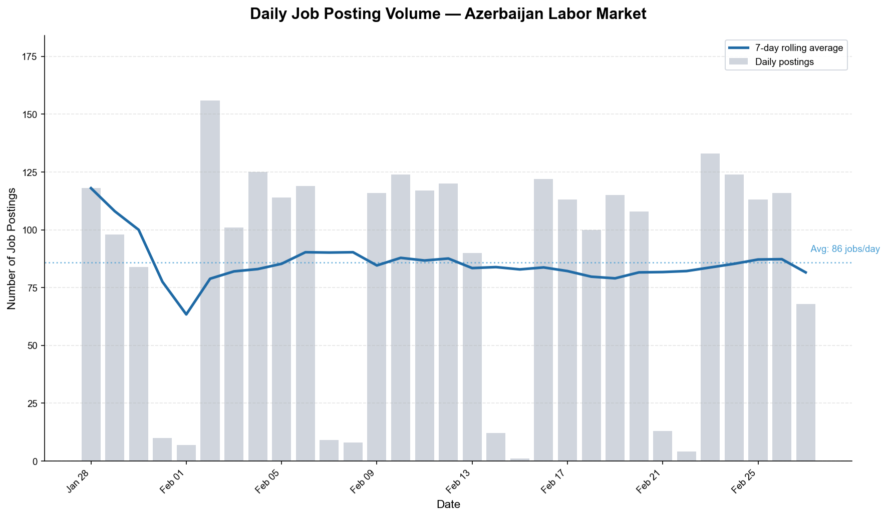
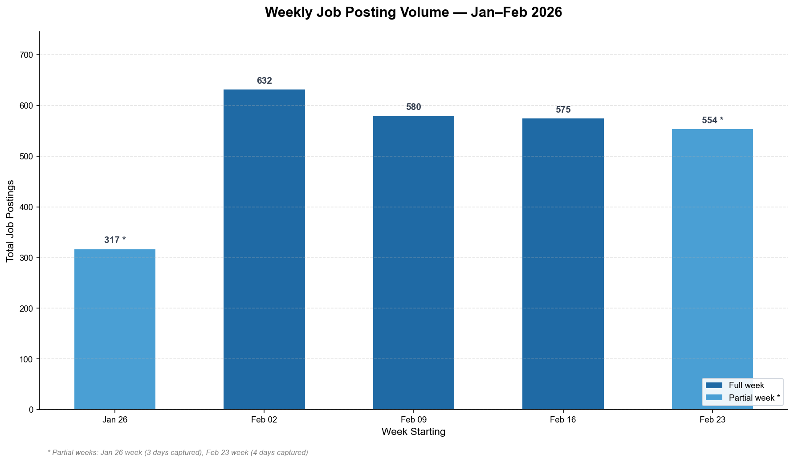
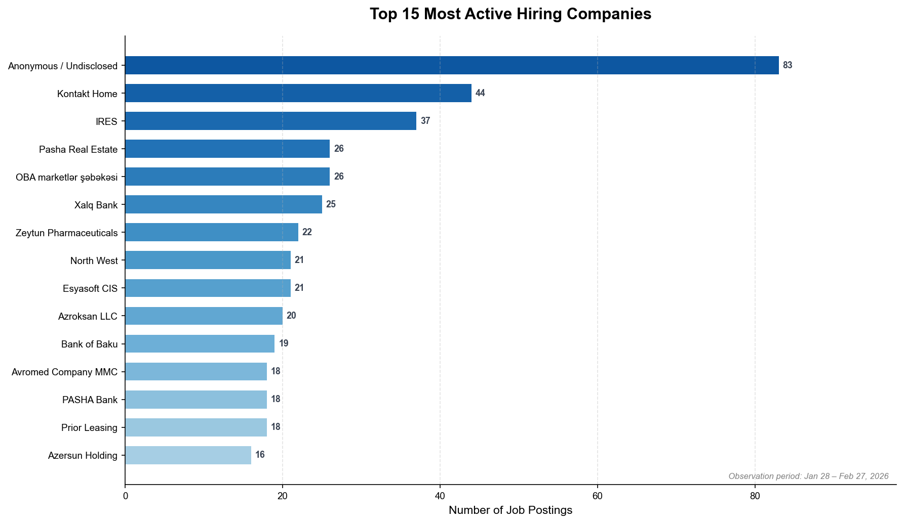
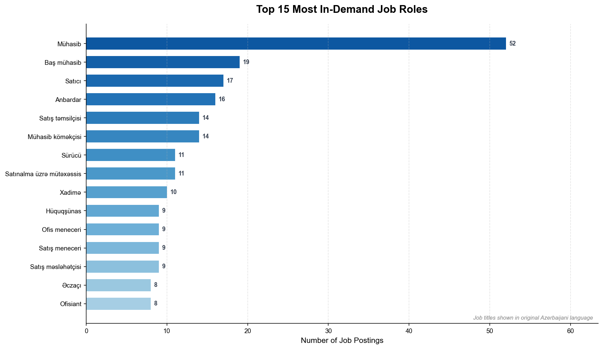
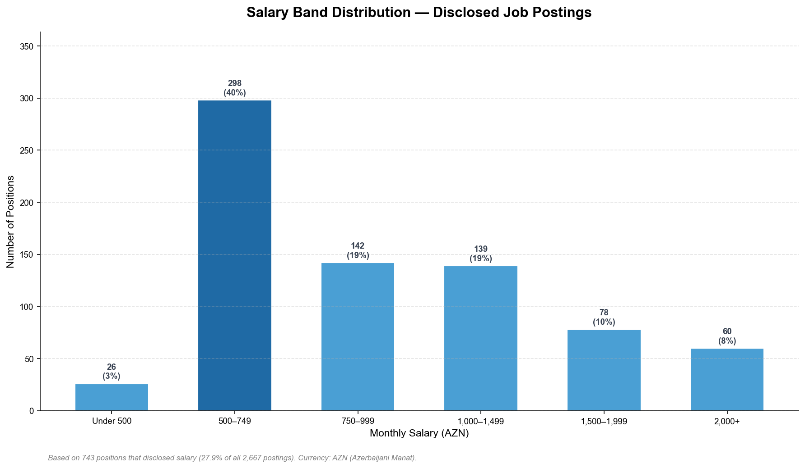
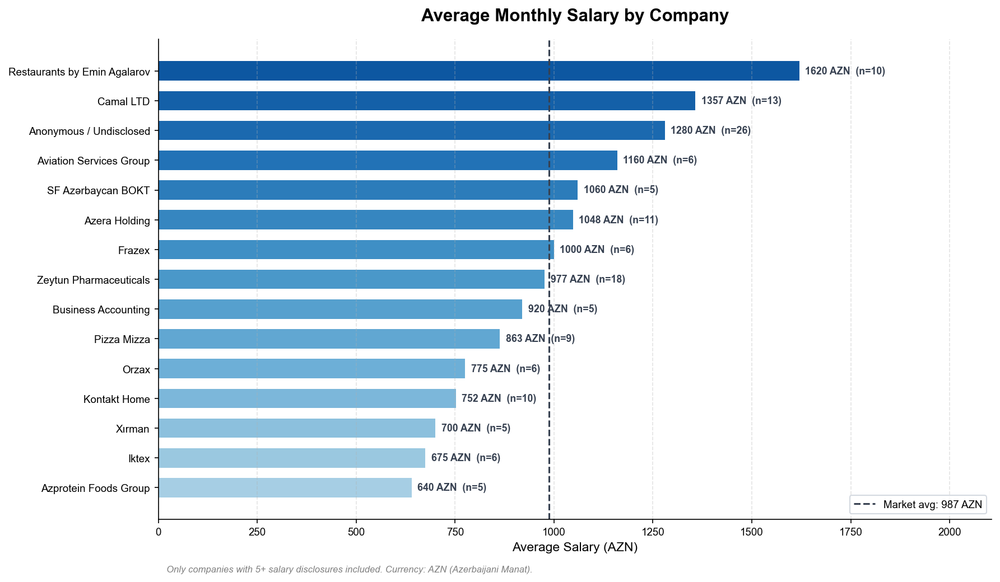
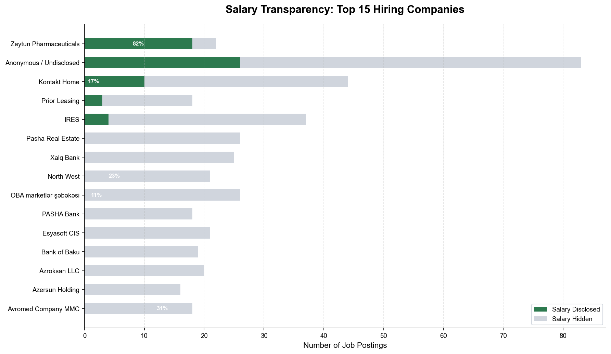
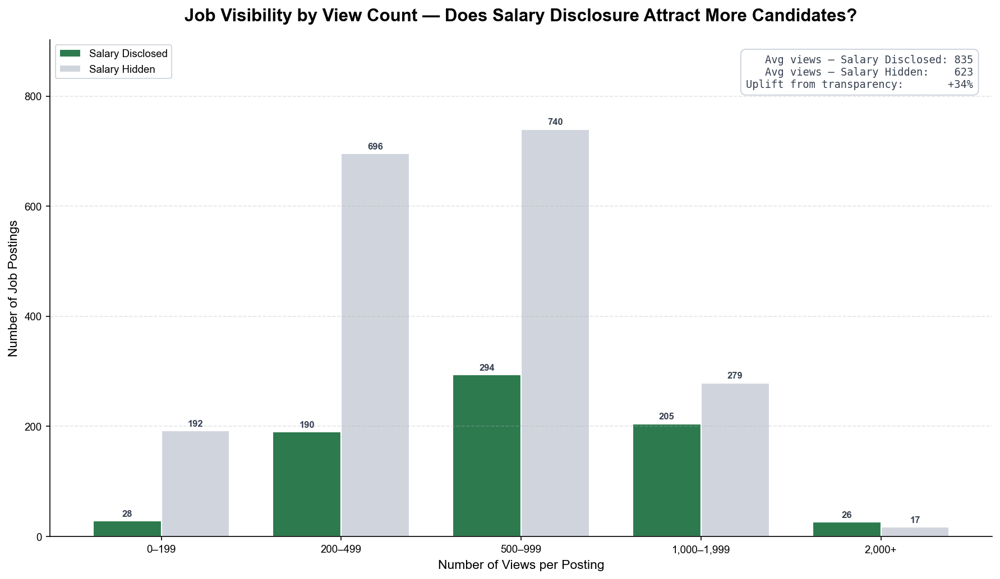
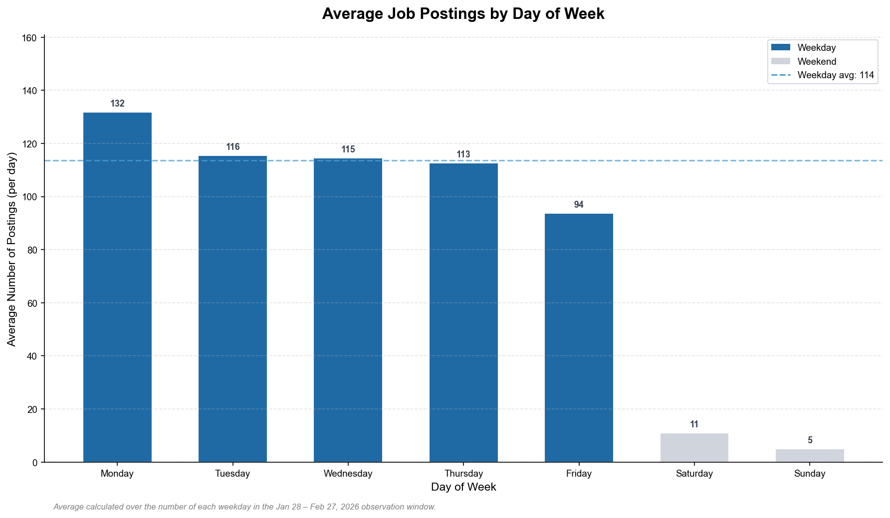

# Azerbaijan Job Market Snapshot — February 2026

**A business intelligence report on 2,667 active job postings from jobsearch.az**
*Observation window: January 28 – February 27, 2026*

---

## Executive Summary

The Azerbaijani job market is operating at a high and consistent velocity. Over the past month, employers posted an average of **~115 new positions every working day** across 970 competing companies. Accounting and finance roles dominate demand, while salary transparency — practised by fewer than one-third of employers — is strongly correlated with higher candidate engagement. The data points to a market in active growth, with clear strategic levers available to employers who want to outperform their competitors in attracting talent.

---

## 1. Market Activity

> *Is the market accelerating, plateauing, or cooling?*

The labor market maintained a **steady, high-volume pace** throughout the entire observation window with no signs of slowdown. Employers posted consistently at approximately 115 positions per working day. Weekly volumes stabilised in the 550–630 range, reflecting a market in sustained hiring mode rather than a seasonal or reactive spike.

A clear weekly rhythm runs through the data: posting activity concentrates from Monday through Thursday, then fades sharply heading into the weekend. This is not a market that pauses — it is a market running on a compressed four-day active week.

**What this means for decision-makers:** Organizations treating hiring as a continuous priority are not alone. The competitive baseline for talent acquisition in Azerbaijan right now is north of 100 new positions per day. Companies that treat hiring as periodic or reactive will fall behind those who are consistently present in the market.

---

## 2. Who Is Hiring

> *Which organizations are competing hardest for talent?*

The market is **broad and fragmented** — 970 companies competed for talent over this period, and no single employer commands an outsized share. The top 15 companies together account for roughly one-fifth of all postings, led by Kontakt Home (44 postings), IRES (37), and Pasha Real Estate (26). Major banks — Xalq Bank, Bank of Baku, and PASHA Bank — are also among the most active hirers, reflecting ongoing expansion in the financial sector.

Notably, 83 postings carried no company name, making "anonymous" postings the single largest category by count. This indicates that a segment of the market is recruiting under stealth — either to test the platform, protect competitive intelligence, or aggregate listings.

**What this means for decision-makers:** No employer has a structural lock on the market. Smaller and mid-sized organizations can compete directly with banks and retail giants on this platform. For talent acquisition teams, understanding which sectors are competing for the same profiles as yours is the first step to differentiation.

---

## 3. What Roles Are in Demand

> *Where is talent demand concentrated?*

Accounting roles are the **single largest category of demand** in the market by a wide margin. The role of Mühasib (Accountant) appeared in 52 postings — three times more than any other individual job title. When all accounting-related roles are considered together (Accountant, Chief Accountant, Accounting Assistant), the cluster exceeds 85 positions, representing more than 3% of the entire market.

Sales and warehouse/logistics roles form the next tier, reflecting the growing operational backbone of retail and distribution companies. The breadth of titles — from drivers and warehouse staff to lawyers and pharmacists — confirms that this is a full-spectrum labor market, not a specialist or technology-focused one.

**What this means for decision-makers:** Companies seeking accountants are entering the most competitive segment of this market. Staffing firms, training providers, and HR teams should factor this scarcity into planning. Employers in retail, logistics, and services are the primary drivers of volume — and they are all hiring at the same time.

---

## 4. The Pay Landscape

> *How is compensation structured across the market?*

Of the 743 positions that disclosed a salary, the **500–749 AZN monthly range accounts for 40% of all disclosed roles** — this is the market's dominant pay tier. Roles paying 1,000 AZN or more represent just under 35% of disclosed positions, and only 8% offer 2,000 AZN or above.

The market average for disclosed salaries sits at **987 AZN per month** (approximately $580 USD), but this average conceals significant spread. At the company level, hospitality leads on compensation: Restaurants by Emin Agalarov averages 1,620 AZN — the highest of any qualifying company. Pharmaceutical and holding companies cluster around the 1,000–1,350 AZN range, while retail chains and food production companies sit near the 600–750 AZN floor.

**What this means for decision-makers:** Companies offering 500–749 AZN are competing in the most crowded segment of the pay spectrum — differentiation on compensation alone is difficult there. Organizations willing and able to cross the 1,000 AZN threshold occupy a distinct competitive tier with meaningfully less direct salary competition. For sectors where talent scarcity is growing, crossing this threshold is the fastest compensation-based lever.

---

## 5. Salary Transparency

> *Who discloses — and who hides — what they pay?*

Salary transparency is the **exception, not the norm**. Across the full market, only 27.9% of job postings disclosed a salary. Among the top 15 employers, the divergence is stark: Zeytun Pharmaceuticals disclosed salary in 82% of its postings, while every major bank in the top 15 — Xalq Bank, PASHA Bank, and Bank of Baku — disclosed salary in exactly 0% of postings. Pasha Real Estate and IRES also maintained full opacity.

This is not an oversight. Large, established institutions are making a deliberate choice to withhold compensation information, likely reflecting internal band structures, negotiation norms, or concerns about internal equity. Smaller and mid-market employers, by contrast, tend to lead with salary as a recruitment tool.

**What this means for decision-makers:** Salary opacity is a strategic choice — but the data in the next section shows it comes at a measurable cost in candidate attention. For companies currently withholding salary: the question is not whether to keep the information private internally, but whether the job listing itself needs to include a range to remain competitive on the platform.

---

## 6. Transparency Drives Visibility

> *Does showing salary actually attract more candidates?*

The answer is unambiguous: **job postings that disclosed a salary received 34% more views on average** than those that did not (835 views vs. 623 views per posting). This advantage holds across the distribution. In the highest-engagement tier — postings receiving 1,000 or more views — salary-disclosed listings achieve near-parity with hidden-salary listings despite being far fewer in number, suggesting that transparency accelerates a posting's ability to reach high-engagement candidates.

The uplift is not marginal. A 34% increase in candidate views, at no additional cost, represents one of the highest-return optimizations available to a recruiter on this platform.

**What this means for decision-makers:** If an organization's goal is to fill positions faster and with more candidate interest, salary disclosure is the single most impactful action a recruiter can take at the point of posting. For leadership debating salary transparency policy: the business case on the recruitment side is clear. The decision then becomes one of internal compensation structure readiness, not candidate reach.

---

## 7. Hiring Cadence

> *When do employers post — and when should you?*

Hiring activity follows a **compressed four-day working week**. Wednesday and Thursday are the peak posting days, averaging 114 and 111 postings respectively. Monday and Friday sit around 100 jobs per day. Saturday and Sunday together account for fewer than 3% of all postings.

This pattern has a practical implication beyond simply knowing when employers are active: job seekers browse when new postings appear. A posting launched on Tuesday or Wednesday morning sits at the top of a fresh, high-traffic daily feed. A posting launched on Friday afternoon competes with almost no new content — but also reaches almost no one actively looking.

**What this means for decision-makers:** Recruiters should prioritise Wednesday and Thursday as their primary posting days for maximum initial visibility. Conversely, employers wanting their postings to stand out with less competition may find Monday morning — when traffic is high but new supply is slightly lower than the Wednesday/Thursday peak — to be a strategic sweet spot.

---

## Key Takeaways at a Glance

| Finding | Implication |
|---|---|
| ~115 jobs posted per working day | Sustained competitive market — consistent presence is required |
| 970 companies competing; no dominant employer | Any organization can compete effectively with the right positioning |
| Accountants are the #1 most sought-after role | Talent scarcity is highest in finance — act early or pay more |
| 40% of disclosed roles pay 500–749 AZN | Crossing 1,000 AZN removes an organization from the most crowded pay tier |
| Only 27.9% of postings disclose salary | Most employers are leaving a competitive advantage on the table |
| Salary disclosure = +34% more candidate views | The highest-ROI recruiting action available at zero cost |
| Wednesday–Thursday are peak posting days | Timing of new posts meaningfully affects initial visibility |

---

## Data Notes

This report is based on 2,667 job postings retrieved from jobsearch.az via its public API during January 28 – February 27, 2026. The dataset covers 970 unique hiring companies and 2,092 distinct job titles. Salary figures are denominated in Azerbaijani Manat (AZN; 1 AZN ≈ $0.59 USD as of February 2026). Salary analysis is based solely on the 743 postings (27.9%) that chose to disclose compensation. View count data reflects platform-reported engagement figures at the time of collection. All job titles appear in their original Azerbaijani language.
